# 🏍️ GearShift — E-Commerce Komponen Otomotif

> Tugas **Midterm Mobile Development — GDGoC Unsri**

**GearShift** adalah aplikasi *mobile* berbasis Flutter yang dirancang untuk memudahkan mekanik dan penggemar otomotif dalam mencari, mendiagnosa, dan membeli komponen mesin sepeda motor secara cepat dan akurat.

Proyek ini merupakan aplikasi **fullstack mobile** — bukan sekadar tampilan UI Flutter — karena terhubung langsung dengan **backend nyata (Supabase)** untuk autentikasi, penyimpanan data produk, transaksi, dan manajemen stok secara *real-time*.

Proyek ini dibangun menggunakan pendekatan **Feature-First Clean Architecture** yang dikombinasikan dengan pola **BLoC (Business Logic Component)** untuk *state management*, serta **Supabase** sebagai *Backend-as-a-Service* (BaaS).

---

## 📑 Daftar Isi

1. [Informasi Proyek](#-informasi-proyek)
2. [Fitur Utama](#-fitur-utama)
3. [Teknologi, Versi & Dependensi](#-teknologi-versi--dependensi)
4. [Arsitektur Aplikasi](#-arsitektur-aplikasi)
5. [Informasi Backend](#-informasi-backend)
6. [Dokumentasi API](#-dokumentasi-api)
7. [Struktur Folder Lengkap](#-struktur-folder-lengkap)
8. [Cara Menjalankan Proyek](#-cara-menjalankan-proyek)
9. [Konfigurasi Environment (.env)](#-konfigurasi-environment-env)
10. [Cuplikan Aplikasi (Screenshots)](#-cuplikan-aplikasi-screenshots)
11. [Standar Kontribusi (Conventional Commits)](#-standar-kontribusi-conventional-commits)
12. [Kontributor](#-kontributor)

---

## 📌 Informasi Proyek

| Atribut | Keterangan |
|---|---|
| Nama Proyek | **GearShift** |
| Mata Kuliah / Kegiatan | Midterm Mobile Development — GDGoC Unsri |
| Tema | E-Commerce Komponen Otomotif (Sparepart Sepeda Motor) |
| Platform | Android / iOS (Flutter) |
| Tipe Proyek | Fullstack Mobile Development (Flutter + Backend Supabase) |
| Repository Asal | `Midterm-Mobile-Development-GDGoC-Unsri` |
| Nama Folder Proyek | `md_midtermproject` |

> 📝 *Catatan: Bagian ini wajib disesuaikan oleh setiap pengerja tugas (nama, NIM, kelas, dan tautan repository hasil fork masing-masing) sebelum dikumpulkan.*

---

## ✨ Fitur Utama

Aplikasi GearShift memiliki berbagai fitur fungsional yang mensimulasikan platform *e-commerce* dunia nyata:

### 🔐 Keamanan & Otentikasi
- Login & registrasi menggunakan **Supabase Auth**.
- Integrasi **Google Sign-In**.
- Modul **Biometric Helper** untuk dukungan keamanan tambahan (Fingerprint / FaceID).
- *Splash Screen* dengan animasi transisi *gradient* yang mulus.

### 📦 Katalog & Detail Produk
- Menampilkan etalase suku cadang secara *real-time* dari database.
- **Shimmer Effect** saat memuat data agar UI terasa responsif.
- Halaman spesifikasi detail produk dengan pengaturan **Quantity** menggunakan BLoC tersendiri (`quantity_bloc`).

### ❤️ Wishlist Interaktif
- Penyimpanan daftar komponen impian menggunakan *query* relasi database (`*, products(*)`).
- Kartu *wishlist* dapat diklik dan memiliki tombol aksi cepat (Hapus atau Pindahkan langsung ke Keranjang).

### 🛒 Keranjang Belanja Pintar (Smart Cart)
- **Logika Upsert:** otomatis menggabungkan (*update quantity*) barang yang sama, atau membuat baris baru (*insert*) jika barang belum ada.
- **Offline Support:** menyimpan status keranjang belanja terakhir di memori lokal menggunakan `SharedPreferences`.

### 💳 Checkout & Manajemen Pesanan
- Pemotongan stok otomatis di *database* pusat saat proses *checkout* berhasil.
- Perekaman dan tampilan **Riwayat Transaksi** (Order History).

### 👤 Manajemen Profil
- Pengaturan dan pembaruan data profil pengguna.

### 🛡️ Panel Admin Khusus
- Dashboard admin untuk menambah atau mengedit stok dan produk ke dalam sistem (`admin_dashboard_page.dart`, `form_product_page.dart`).

---

## 🛠️ Teknologi, Versi & Dependensi

### Lingkungan Pengembangan

| Komponen | Versi yang Digunakan |
|---|---|
| Flutter SDK | `>=3.x` *(sesuaikan dengan output `flutter --version`)* |
| Dart SDK | `>=3.x` *(sesuaikan dengan `environment:` pada `pubspec.yaml`)* |
| IDE | Android Studio / VS Code |

> ⚠️ Versi pasti Flutter & Dart yang dipakai dapat dicek melalui berkas `pubspec.yaml` (bagian `environment:`) dan dengan menjalankan `flutter --version` pada terminal.

### Dependensi Utama (`pubspec.yaml`)

| Package | Fungsi |
|---|---|
| `flutter_bloc` | State management berbasis BLoC pattern |
| `equatable` | Perbandingan objek/state secara efisien pada BLoC |
| `supabase_flutter` | Koneksi ke backend Supabase (Auth, Database, Storage) |
| `dio` | HTTP Client untuk komunikasi REST API |
| `shared_preferences` | Penyimpanan lokal (offline cache keranjang & sesi) |
| `cached_network_image` | Caching gambar produk agar loading lebih cepat |
| `google_sign_in` | Login menggunakan akun Google |
| `local_auth` | Autentikasi biometrik (fingerprint/FaceID) |
| `flutter_dotenv` | Memuat variabel environment (`.env`) secara aman |
| `shimmer` | Efek *placeholder loading* (skeleton UI) |

> 📝 *Catatan: daftar di atas merangkum dependensi inti berdasarkan struktur proyek. Daftar versi spesifik (`^x.x.x`) dapat dilihat langsung pada berkas `pubspec.yaml` di root proyek — pastikan untuk menyalin isi `pubspec.yaml` terbaru ke README jika ada penyesuaian versi.*

---

## 🏛️ Arsitektur Aplikasi

GearShift menggunakan **Feature-First Clean Architecture**, di mana setiap fitur (`auth`, `cart`, `product`, `wishlist`, dst.) memiliki tiga lapisan terpisah:

```
feature/
├── data/         → Implementasi repository & model (sumber data: Supabase/REST API)
├── domain/       → Interface/abstraksi repository (kontrak bisnis)
└── presentation/ → BLoC (state management) & UI (pages/widgets)
```

**Alur data sederhana:**

```
UI (Page/Widget)
   │  memicu Event
   ▼
BLoC (Business Logic)
   │  memanggil method
   ▼
Repository (Domain → Data)
   │  request via Dio
   ▼
Supabase REST API (PostgreSQL)
   │  response data
   ▼
BLoC mengubah State
   │
   ▼
UI ter-render ulang (rebuild)
```
**Diagram Alur Data**


---

## ☁️ Informasi Backend

GearShift **tidak menggunakan backend tradisional custom** (seperti Express.js/Laravel terpisah), melainkan menggunakan **Supabase** sebagai *Backend-as-a-Service* (BaaS) yang menyediakan:

| Layanan Supabase | Kegunaan dalam Aplikasi |
|---|---|
| **Supabase Auth** | Registrasi, login, dan manajemen sesi pengguna (termasuk Google Sign-In) |
| **Supabase Database (PostgreSQL)** | Penyimpanan tabel `products`, `carts`, `wishlists`, `orders`, dan `profiles` |
| **Supabase REST API (PostgREST)** | Endpoint otomatis untuk CRUD setiap tabel, diakses melalui `dio` |
| **Row Level Security (RLS)** *(disarankan)* | Membatasi akses data agar setiap pengguna hanya dapat mengubah datanya sendiri |

### Estimasi Skema Tabel Utama

| Tabel | Deskripsi Singkat |
|---|---|
| `products` | Data suku cadang: nama, harga, stok, gambar, kategori |
| `carts` | Item keranjang belanja milik pengguna (relasi ke `products`) |
| `wishlists` | Daftar produk favorit pengguna (relasi ke `products`) |
| `orders` | Riwayat transaksi & ringkasan checkout |
| `profiles` | Data tambahan pengguna (nama, foto, dll.), terhubung dengan Supabase Auth |

> 📝 *Catatan: skema di atas disusun berdasarkan analisis fitur & endpoint yang digunakan. Disarankan melampirkan ERD (Entity Relationship Diagram) asli dari Supabase Table Editor agar dokumentasi backend lebih akurat dan lengkap.*

---

## 📡 Dokumentasi API

Aplikasi ini berkomunikasi dengan Supabase melalui protokol **REST API (PostgREST)** menggunakan package `dio`. Berikut rangkuman endpoint utama:

| Modul | Endpoint Path | Method | Fungsi / Deskripsi |
|---|---|---|---|
| Produk | `/products?select=*` | `GET` | Mengambil seluruh daftar suku cadang |
| Produk | `/products?id=eq.{id}` | `PATCH` | Sinkronisasi / pemotongan stok otomatis |
| Wishlist | `/wishlists?user_id=eq.{uid}&select=*,products(*)` | `GET` | Memuat daftar impian beserta detail produk terkait |
| Keranjang | `/carts` | `POST` | Menambahkan komponen baru ke dalam keranjang |
| Keranjang | `/carts?id=eq.{id}` | `PATCH` | **Upsert**: memperbarui *quantity* jika produk sudah ada |
| Checkout | `/orders` | `POST` | Menyimpan ringkasan belanja dan total harga pengguna |

**Base URL:** `https://<project-id>.supabase.co/rest/v1/`

**Header wajib pada setiap request:**
```
apikey: <SUPABASE_ANON_KEY>
Authorization: Bearer <SUPABASE_ANON_KEY atau Access Token User>
Content-Type: application/json
```

> 💡 *Untuk dokumentasi API yang lebih komprehensif, disarankan membuat koleksi **Postman** (export sebagai `.json`) atau dokumentasi **Swagger/OpenAPI**, lalu menyertakan tautan/berkasnya pada bagian ini.*

---

## 📂 Struktur Folder Lengkap

```text
md_midtermproject/
├── assets/
│   └── images/
│       ├── Logoku.png                     # File logo utama aplikasi
│       └── Logoku1.png                    # Alternatif/variasi logo aplikasi
├── lib/
│   ├── core/                              # Komponen global (Shared/Reusable)
│   │   ├── config/                        # Pengaturan konfigurasi app
│   │   ├── constants/                     # Nilai konstan (Warna, teks statis, ukuran)
│   │   ├── error/                         # Penanganan error (Exceptions & Failures)
│   │   ├── network/
│   │   │   └── dio_client.dart            # HTTP Client menggunakan Dio
│   │   ├── security/                      # Keamanan data tambahan
│   │   ├── theme/
│   │   │   └── app_theme.dart             # Konfigurasi ThemeData Terang/Gelap
│   │   └── utils/
│   │       ├── biometric_helper.dart      # Autentikasi Sidik Jari / FaceID
│   │       └── theme_helper.dart          # Helper manipulasi UI/Tema
│   │
│   ├── features/                          # Direktori Fitur Berbasis Modul
│   │   ├── admin/                         # Modul Pengelolaan Konten (Admin)
│   │   │   └── presentation/
│   │   │       └── pages/
│   │   │           ├── admin_dashboard_page.dart
│   │   │           └── form_product_page.dart
│   │   │
│   │   ├── auth/                          # Modul Keamanan & Sesi Pengguna
│   │   │   ├── data/
│   │   │   │   ├── models/
│   │   │   │   │   └── profile_model.dart
│   │   │   │   └── auth_repository.dart
│   │   │   ├── domain/
│   │   │   └── presentation/
│   │   │       ├── bloc/
│   │   │       │   ├── auth_bloc.dart
│   │   │       │   ├── auth_event.dart
│   │   │       │   └── auth_state.dart
│   │   │       └── pages/
│   │   │           ├── login_page.dart
│   │   │           ├── register_page.dart
│   │   │           └── splash_page.dart
│   │   │
│   │   ├── cart/                          # Modul Manajemen Keranjang
│   │   │   ├── data/
│   │   │   │   └── repositories/
│   │   │   │       └── cart_repository_impl.dart
│   │   │   ├── domain/
│   │   │   │   └── repositories/
│   │   │   │       └── cart_repository.dart
│   │   │   └── presentation/
│   │   │       ├── bloc/
│   │   │       │   ├── cart_bloc.dart
│   │   │       │   ├── cart_event.dart
│   │   │       │   └── cart_state.dart
│   │   │       └── pages/
│   │   │           └── cart_page.dart
│   │   │
│   │   ├── checkout/                      # Modul Transaksi Pembayaran
│   │   │   ├── data/
│   │   │   ├── domain/
│   │   │   └── presentation/
│   │   │       └── pages/
│   │   │           └── checkout_page.dart
│   │   │
│   │   ├── home/                          # Modul Navigasi Utama
│   │   │   └── presentation/
│   │   │       └── pages/
│   │   │           └── main_page.dart
│   │   │
│   │   ├── order/                         # Modul Riwayat Belanja
│   │   │   ├── data/
│   │   │   │   └── repositories/
│   │   │   │       └── order_repository_impl.dart
│   │   │   ├── domain/
│   │   │   │   └── repositories/
│   │   │   │       └── order_repository.dart
│   │   │   └── presentation/
│   │   │       ├── bloc/
│   │   │       │   ├── order_bloc.dart
│   │   │       │   ├── order_event.dart
│   │   │       │   └── order_state.dart
│   │   │       └── pages/
│   │   │           └── order_history_page.dart
│   │   │
│   │   ├── product/                       # Modul Manajemen Suku Cadang
│   │   │   ├── data/
│   │   │   │   ├── models/
│   │   │   │   │   └── product_model.dart
│   │   │   │   └── repositories/
│   │   │   │       └── product_repository_impl.dart
│   │   │   ├── domain/
│   │   │   │   └── repositories/
│   │   │   │       └── product_repository.dart
│   │   │   └── presentation/
│   │   │       ├── bloc/
│   │   │       │   ├── product_bloc.dart
│   │   │       │   ├── product_event.dart
│   │   │       │   ├── product_state.dart
│   │   │       │   ├── quantity_bloc.dart
│   │   │       │   ├── quantity_event.dart
│   │   │       │   └── quantity_state.dart
│   │   │       └── pages/
│   │   │           ├── catalog_page.dart
│   │   │           └── product_detail_page.dart
│   │   │       └── widgets/
│   │   │           └── product_shimmer.dart
│   │   │
│   │   ├── profile/                       # Modul Manajemen Akun Pengguna
│   │   │   ├── data/
│   │   │   │   └── repositories/
│   │   │   │       └── profile_repository_impl.dart
│   │   │   ├── domain/
│   │   │   │   └── repositories/
│   │   │   │       └── profile_repository.dart
│   │   │   └── presentation/
│   │   │       ├── bloc/
│   │   │       │   ├── profile_bloc.dart
│   │   │       │   ├── profile_event.dart
│   │   │       │   └── profile_state.dart
│   │   │       └── pages/
│   │   │           └── profile_page.dart
│   │   │
│   │   └── wishlist/                      # Modul Barang Impian
│   │       ├── data/
│   │       │   └── repositories/
│   │       │       └── wishlist_repository_impl.dart
│   │       ├── domain/
│   │       │   └── repositories/
│   │       │       └── wishlist_repository.dart
│   │       └── presentation/
│   │           ├── bloc/
│   │           │   ├── wishlist_bloc.dart
│   │           │   ├── wishlist_event.dart
│   │           │   └── wishlist_state.dart
│   │           └── pages/
│   │               └── wishlist_page.dart
│   │
│   └── main.dart                          # Inisialisasi awal & Registrasi BLoC global
│
├── .env                                   # Konfigurasi lokal kredensial API (jangan di-commit)
├── .gitignore                             # Daftar pengecualian upload git
├── pubspec.yaml                           # Daftar dependensi & metadata proyek
└── README.md                              # Dokumentasi proyek (berkas ini)
```

---

## 🚀 Cara Menjalankan Proyek

Ikuti langkah-langkah berikut secara berurutan untuk menjalankan proyek di perangkat lokal Anda.

### 1. Prasyarat (Prerequisites)
Pastikan perangkat Anda telah memiliki:
- **Flutter SDK** sudah terinstal dan dikonfigurasi (`flutter doctor` tidak menunjukkan error fatal)
- **Android Studio** / **Xcode** (untuk emulator/simulator) atau perangkat fisik
- Akun **Supabase** aktif (untuk membuat project backend sendiri jika diperlukan)

### 2. Clone Repository
```bash
git clone https://github.com/TatangBae16/Midterm-Mobile-Development-GDGoC-Unsri.git
cd md_midtermproject
```

### 3. Unduh Dependencies
```bash
flutter pub get
```

### 4. Konfigurasi Environment Variable
Buat berkas `.env` di root proyek (lihat bagian [Konfigurasi Environment](#-konfigurasi-environment-env) di bawah).

### 5. Jalankan Aplikasi
```bash
flutter run
```

> 💡 Pastikan emulator/perangkat sudah aktif sebelum menjalankan perintah `flutter run`. Cek daftar perangkat yang terdeteksi dengan `flutter devices`.

### 6. (Opsional) Build APK untuk Rilis
```bash
flutter build apk --release
```

---

## 🔑 Konfigurasi Environment (.env)

Buat sebuah berkas baru bernama **`.env`** di root direktori proyek (sejajar dengan berkas `pubspec.yaml`), lalu isi dengan kredensial Supabase Anda:

```env
SUPABASE_URL=masukkan_url_disini
SUPABASE_ANON_KEY=masukkan_kunci_anon_di_sini
MIDTRANS_SERVER_KEY=masukkan_kunci_server_di_sini
```
**Penjelasan Variabel:**
* **`SUPABASE_URL`**: Alamat utama (*API Endpoint*) untuk menghubungkan aplikasi dengan *database* Supabase.
* **`SUPABASE_ANON_KEY`**: Kunci akses publik yang wajib disertakan agar aplikasi memiliki izin untuk membaca dan menulis data di Supabase.
* **`MIDTRANS_SERVER_KEY`**: Kunci otentikasi dari Midtrans untuk memproses transaksi dan gerbang pembayaran (*Payment Gateway*).
---

## 🖼️ Cuplikan Aplikasi (Screenshots)

### 👤 Tampilan Pengguna (User)

| Halaman Login | Katalog Produk | Detail Produk |
|---|---|---|
| 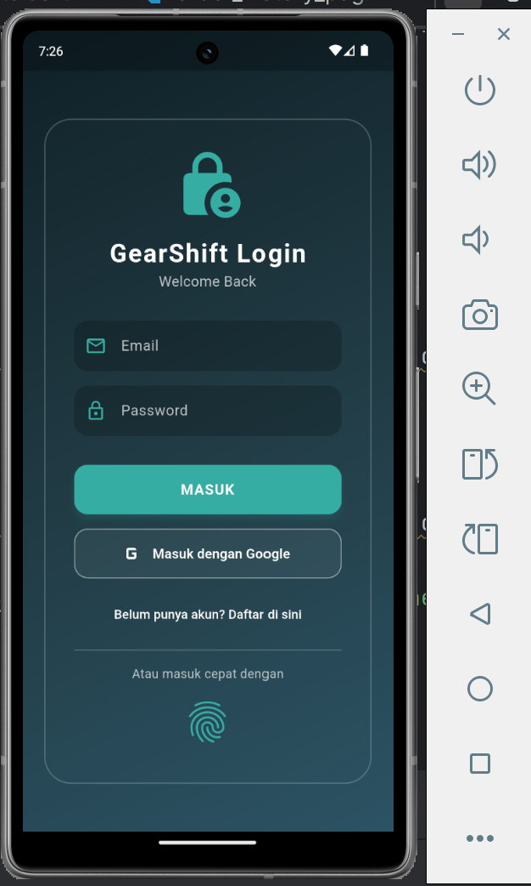 | 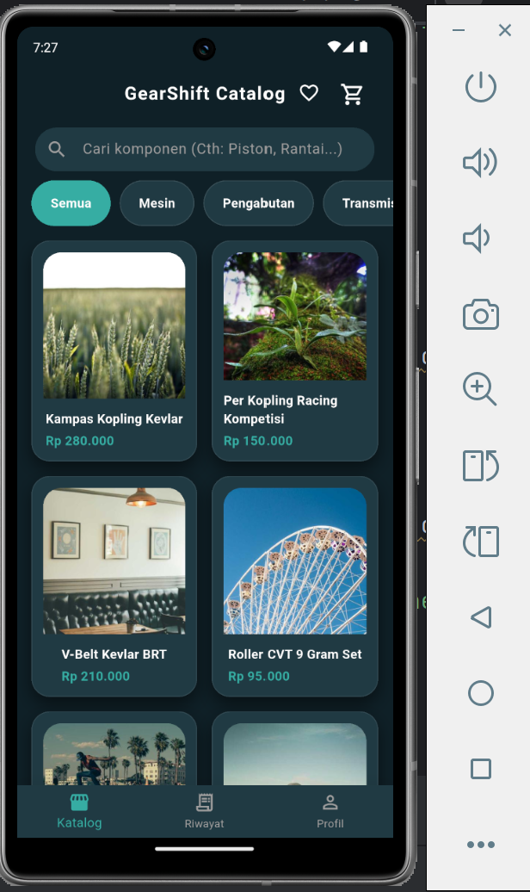 | 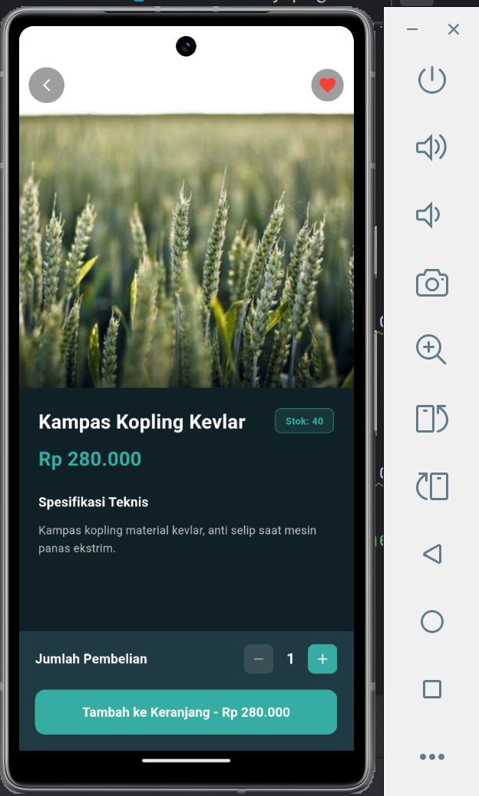 |

| Halaman Wishlist | Keranjang | Checkout |
|---|---|---|
| 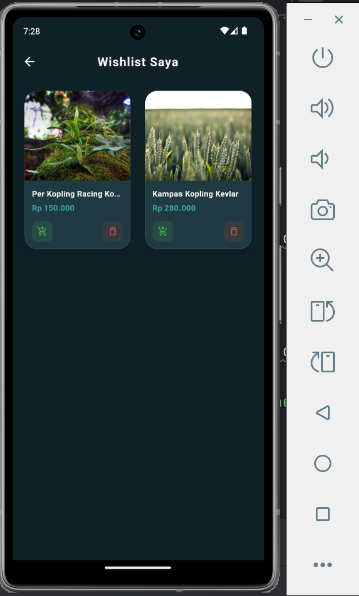 | 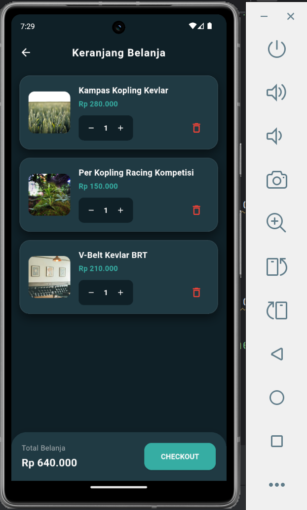 | 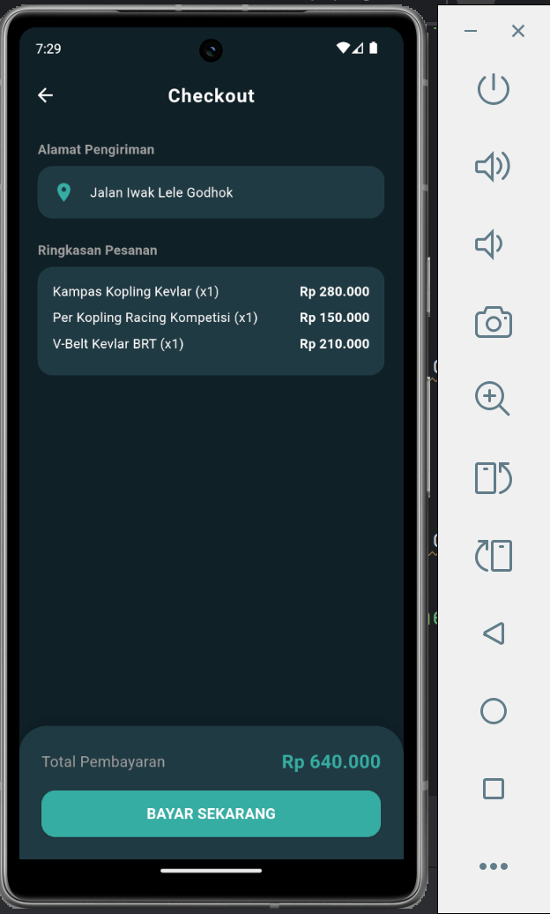 |

| Riwayat Transaksi (User) | Profil User |
|---|---|
| 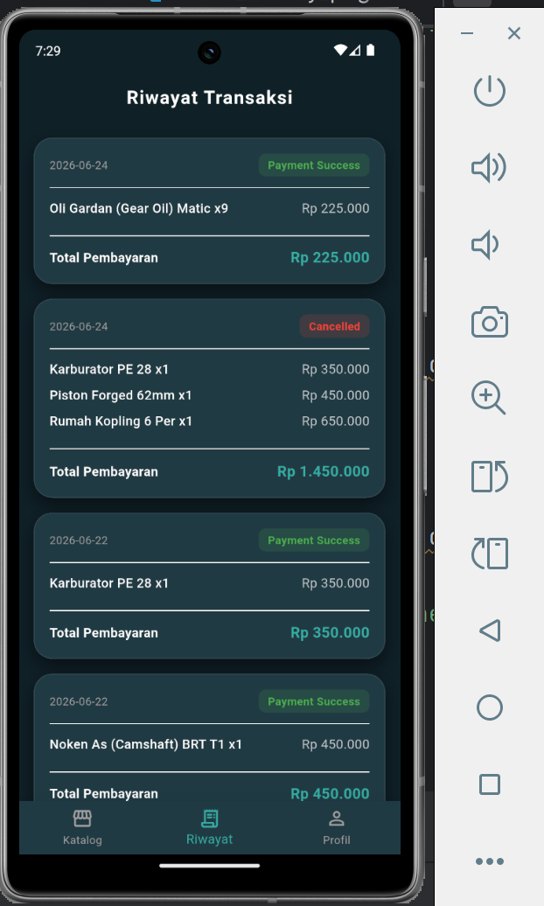 | 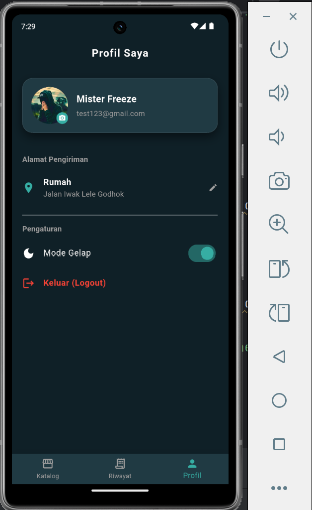 |

### 🛡️ Tampilan Admin

| Admin Dashboard | Form Kelola Barang | Transaksi Semua User (Admin) |
|---|---|---|
| 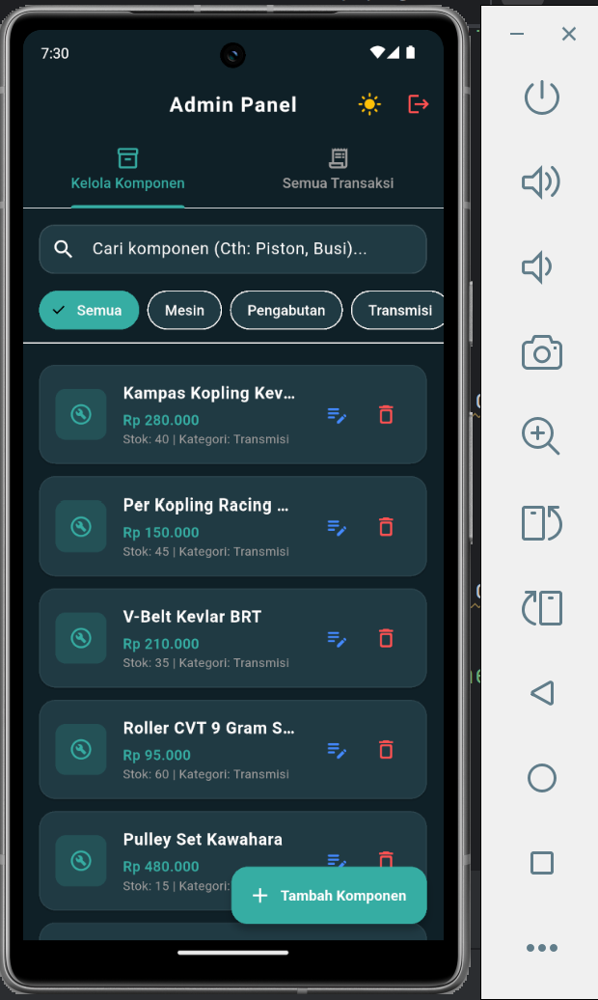 | 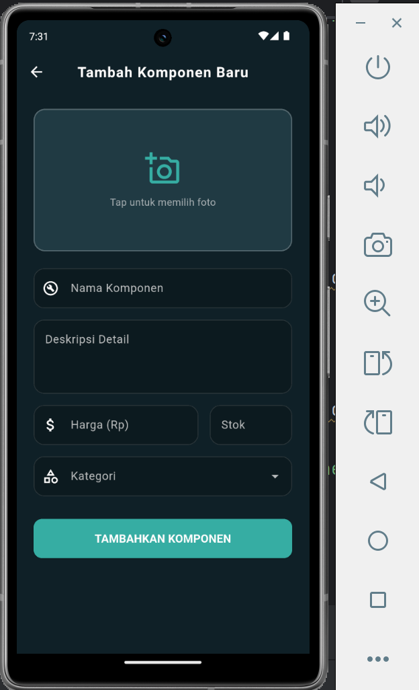 | 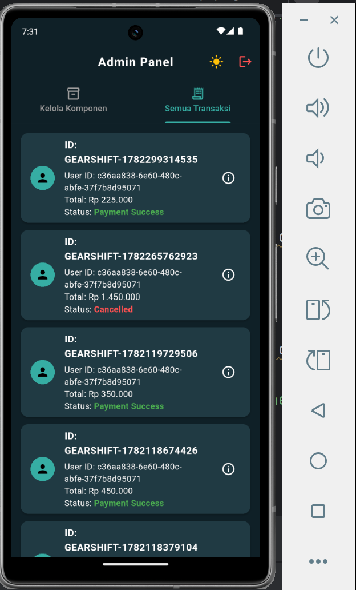 |

> 💡 *Disarankan menambahkan GIF demo alur aplikasi (login → katalog → checkout) untuk melengkapi dokumentasi.*

---

## 📝 Standar Kontribusi (Conventional Commits)

Seluruh riwayat *commit* pada proyek ini mengikuti standar **[Conventional Commits](https://www.conventionalcommits.org/)** agar riwayat perubahan tetap rapi dan mudah dilacak.

### Format Commit
```
<tipe>(<lingkup opsional>): <deskripsi singkat>
```

### Tipe Commit yang Umum Digunakan

| Tipe | Kegunaan | Contoh |
|---|---|---|
| `feat` | Menambahkan fitur baru | `feat(cart): tambahkan logika upsert quantity` |
| `fix` | Memperbaiki bug | `fix(auth): perbaiki bug session tidak persist` |
| `refactor` | Refaktor kode tanpa mengubah fungsi | `refactor(product): pisahkan logika quantity ke bloc baru` |
| `style` | Perubahan tampilan/format kode (tanpa logic) | `style(theme): perbarui palet warna utama` |
| `docs` | Perubahan dokumentasi | `docs(readme): lengkapi dokumentasi API` |
| `chore` | Tugas pendukung (config, dependency, dll.) | `chore: update dependensi supabase_flutter` |
| `test` | Menambahkan/memperbaiki pengujian | `test(cart_bloc): tambahkan unit test cart bloc` |

---

## 👤 Kontributor

| Nama                    | NIM              | Peran |
|-------------------------|------------------|---|
| *TARUNA RAJASA IRYAWAN* | *09021282328071* | Developer |

---

## 📄 Lisensi

Proyek ini dibuat untuk keperluan **tugas akademik (Midterm Mobile Development — GDGoC Unsri)** dan tidak ditujukan untuk penggunaan komersial.